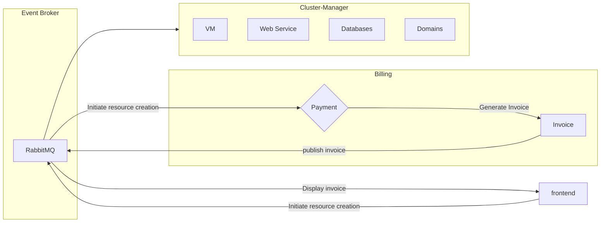
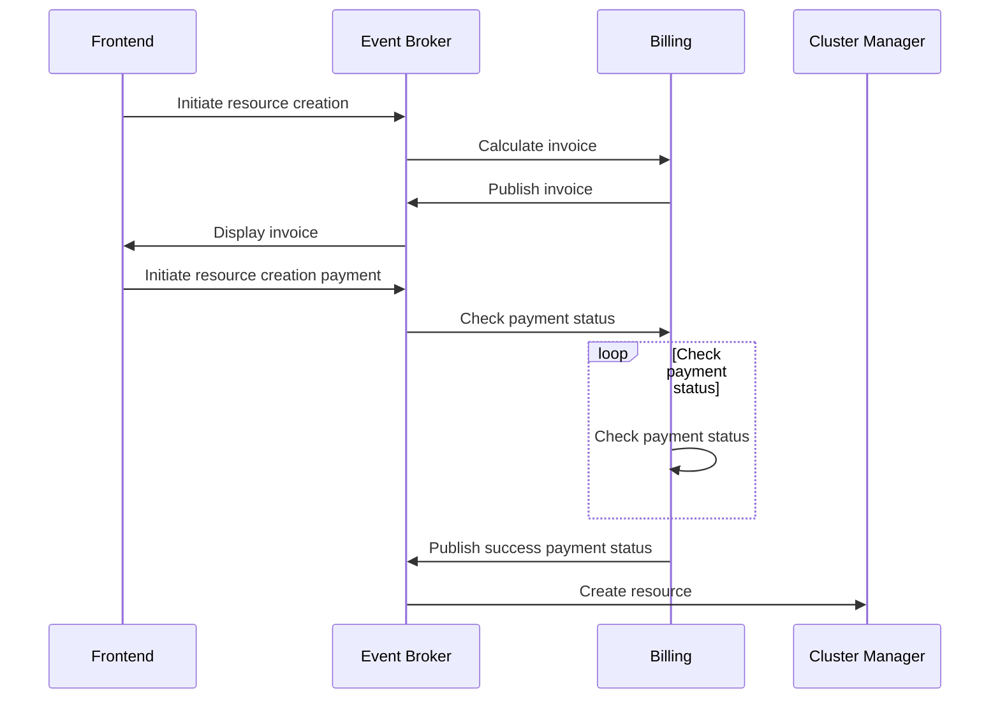

# SwiftCloud Resource Creation

SwiftCloud service creation is a process that involves defining and provisioning resources within the SwiftCloud platform. These resources can include virtual machines, networks, storage, and other infrastructure components.
Below we outline a typical technical workflow for creating resources in SwiftCloud.

## Event Driven Architecture

SwiftCloud follows an event-driven architecture, where events trigger actions and workflows. This approach allows for flexible and scalable resource creation. To achieve this, we use a combination of tools and technologies, including:

- Knative Eventing: A serverless eventing platform that enables the creation of event-driven applications.
- RabbitMQ: A message broker that facilitates communication between different components in the SwiftCloud platform.
- Kubernetes: The underlying container orchestration platform that manages and deploys resources.

## Workflow Services

The involves mainly three services:

- Frontend: The frontend service is responsible for handling user requests and interacting with the backend services. It receives user requests, validates them, and sends them to the backend services. The frontend service also handles user authentication and authorization.
- Billing: The billing service is responsible for managing the billing and pricing of resources in SwiftCloud. It calculates the cost of resources based on usage and billing cycles. The billing service is also responsible for generating invoices and tracking payments.
- Service Cluster Manager: The service cluster manager is responsible for managing the lifecycle of services in SwiftCloud. It creates, updates, and deletes services based on user requests. The service cluster manager also manages the configuration of services, such as scaling, networking, and storage.

### Workflow Lifecycle

The service creation workflow in SwiftCloud is initiated by the frontend service, which receives user requests and validates them. The frontend service then sends the user request to the billing service, which calculates the cost of the resource and generates an invoice. The billing service then sends the invoice to the frontend service, which displays it to the user.
This action also creates a background process to check the status of the payment, depending on the payment status, the service cluster manager creates the resource.

### Workflow Diagram

### Sequence Diagram

