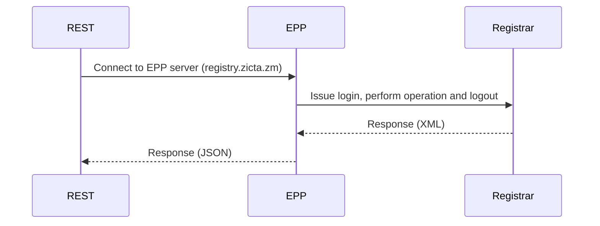
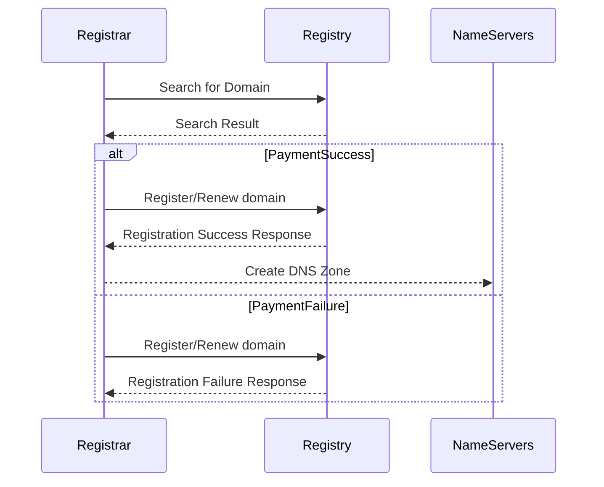

# Overview

## EPP

An application that exposes EPP (Extensible Provisioning Protocol) via RESTful API.

Underneath the hood, the application service uses EPP (Extensible Provisioning Protocol) to communicate with the Domain registry and expose REST endoints.

### EPP (Extensible Provisioning Protocol)

EPP stands for Extensible Provisioning Protocol. It is a protocol used for communication between domain name registries and registrars for provisioning domain name registrations. 

Some key aspects of EPP:

- EPP is a XML-based protocol that uses a client-server architecture. Registrars act as EPP clients that connect to the EPP server operated by the registry.

- EPP supports a wide range of domain name provisioning operations like check availability, register, renew, delete etc. 

- EPP is extensible - it provides a framework that can be extended with new features and functions through XML schemas.

- EPP provides a secure and standardized way for registrars to manage domain names on behalf of registrants.

In summary, EPP enables automation and standardization of domain name provisioning between registries and registrars.

### EPP Users

- **A registrant** is the individual or organization that registers and owns a domain name. The registrant purchases the domain name from a registrar.

- **A registry** operates the top-level domain (like .com, .net, .org etc) and maintains the directory of domain names registered in that TLD. The registry operates the EPP server that registrars connect to for domain name operations.

- **A registrar** is an accredited business that sells domain names to registrants. Registrars connect to the registries EPP server to perform domain name registration and management on behalf of registrants.

## EPP Implementation

The epp client implements EPP by opening a raw TCP ***(not HTTP)*** connection to the EPP server on port 700 (default port 700, but can be any other port). Once the connection is established, the client can send EPP XML commands and receive XML responses over this TCP connection.

This allows the epp client to communicate with the EPP server using the standardized EPP protocol. The client handles connecting to the server, sending requests, parsing responses and returning the results to the calling application.

Every TCP connection will have its own session. The session is maintained by the EPP server. The session is used to maintain the state of the connection and all operations that are to be performed, should be done within a sinlge TCP connection.

Below diagrams shows how a domain registrar with a payment option process would flow in such a setup.

### EPP With Payment Integration

