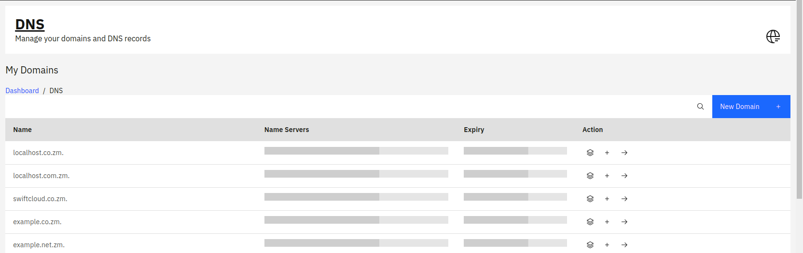
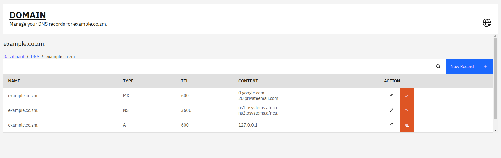
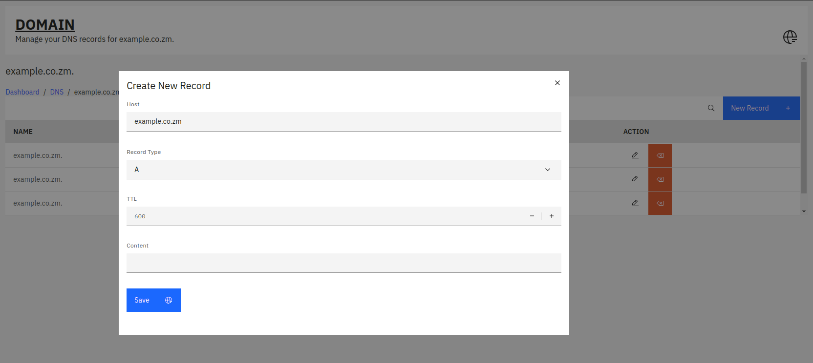
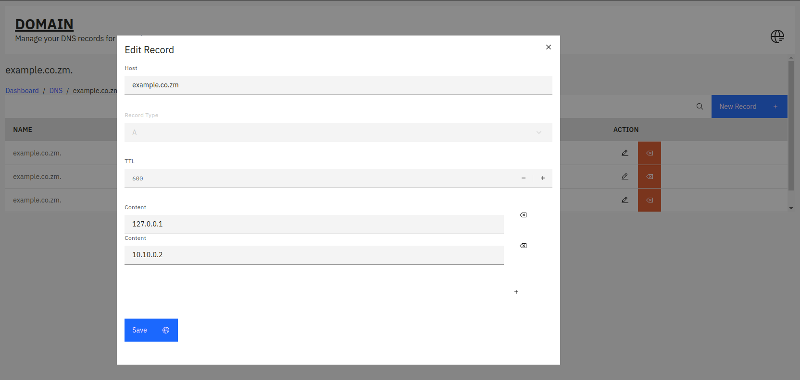

## What is SwiftCloud DNS?

In a world where digital presence is paramount, think of SwiftCloud DNS as your digital compass, guiding your online presence with precision and reliability. It’s more than just a DNS service; it’s a holistic domain management ecosystem designed to keep your websites fast, secure, and always accessible. From intricate domain configurations to lightning-fast DNS resolutions, SwiftCloud DNS is built to elevate your digital operations to new heights.

## Scalable Solutions

From startups to enterprises, SwiftCloud DNS scales with your needs. Whether you’re handling a few domains or managing a global network, our solutions grow with you. Enjoy the flexibility to adapt your DNS infrastructure as your business evolves, without compromising on performance or reliability.

## Managing Domains with Ease

Here, you can effortlessly manage your domains, including adding, editing, and deleting records. Our intuitive interface ensures that even the most complex domain configurations are a breeze to handle.

## View All Domains

The domain name list has a forward arrow to view the domain records

## Domain Management

## Create Domain Record

Add the content of the record in the text box and click on the save button. Then wait for propagation to complete.

## Add Multiple Domain Records

The platform allows one to add muliple IPs to the same domain record. This is ideal in a scenario where you want to do DNS load balancing.

## In Summary

SwiftCloud DNS represents the pinnacle of domain and DNS infrastructure. With its combination of smart management, blazing-fast speed, advanced security (DNSSEC), and seamless integration, SwiftCloud DNS is your gateway to a superior digital experience. Step into the future of domain management with SwiftCloud DNS, where innovation and excellence converge.